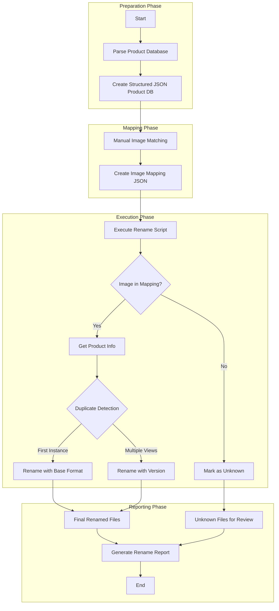

# BGW Doors Image Renaming System - Examples & Documentation

## Sample Product Database

Below is a sample of the product database JSON structure for reference:

```json
{
  "products": [
    {
      "id": "M580E30X30X80RH",
      "full_name": "Solid Wood Exterior Door M580E",
      "category": "wood",
      "product_code": "M580E",
      "clean_name": "solid-wood-exterior-door-m580e",
      "normalized_name": "wood__solid-wood-exterior-door-m580e"
    },
    {
      "id": "M705A30X30X80RH",
      "full_name": "Solid Wood Exterior Door M705A",
      "category": "wood",
      "product_code": "M705A",
      "clean_name": "solid-wood-exterior-door-m705a",
      "normalized_name": "wood__solid-wood-exterior-door-m705a"
    },
    {
      "id": "ID0230X30X96RH",
      "full_name": "Iron Exterior Door #ID02 Iron Door",
      "category": "iron",
      "product_code": "ID02",
      "clean_name": "iron-exterior-door-id02-iron-door",
      "normalized_name": "iron__iron-exterior-door-id02-iron-door"
    },
    {
      "id": "FMKA12X36X12X80RH",
      "full_name": "Fiberglass Exterior Door FD05",
      "category": "fiberglass",
      "product_code": "FD05",
      "clean_name": "fiberglass-exterior-door-fd05",
      "normalized_name": "fiberglass__fiberglass-exterior-door-fd05"
    },
    {
      "id": "",
      "full_name": "Slab Solid Wood Door – 580E",
      "category": "slab",
      "product_code": "580E",
      "clean_name": "slab-solid-wood-door-580e",
      "normalized_name": "slab__slab-solid-wood-door-580e"
    }
  ]
}
```

## Sample Image Mapping

Below is a sample of the image mapping JSON structure:

```json
{
  "images": [
    {
      "filename": "WhatsApp Image 2026-01-30 at 9.12.55 AM_final.png",
      "product_id": "ID0230X30X96RH",
      "category": "iron",
      "product_name": "Iron Exterior Door #ID02 Iron Door",
      "confidence": "high",
      "version": 1,
      "notes": "Black iron door with distinctive scroll pattern"
    },
    {
      "filename": "WhatsApp Image 2026-01-30 at 9.12.56 AM (1)_final.png",
      "product_id": "ID0230X30X96RH",
      "category": "iron",
      "product_name": "Iron Exterior Door #ID02 Iron Door",
      "confidence": "high",
      "version": 2,
      "notes": "Different angle of the same door"
    },
    {
      "filename": "WhatsApp Image 2026-01-30 at 9.12.56 AM (2)_final.png",
      "product_id": "M580E30X30X80RH",
      "category": "wood",
      "product_name": "Solid Wood Exterior Door M580E",
      "confidence": "medium",
      "version": 1,
      "notes": "Dark wood door with glass panels"
    },
    {
      "filename": "WhatsApp Image 2026-01-30 at 9.12.57 AM_final.png",
      "product_id": "FMKA12X36X12X80RH",
      "category": "fiberglass",
      "product_name": "Fiberglass Exterior Door FD05",
      "confidence": "high",
      "version": 1,
      "notes": "Brown fiberglass door with decorative iron pattern"
    },
    {
      "filename": "WhatsApp Image 2026-01-30 at 10.03.01 AM (6)_final.png",
      "product_id": "",
      "category": "unknown",
      "product_name": "",
      "confidence": "low",
      "version": 1,
      "notes": "Cannot identify this door"
    }
  ]
}
```

## Workflow Diagram

The complete workflow for the door image renaming system is illustrated below:



## User Documentation

### BGW Door Image Renaming System - User Guide

#### Overview

This system enables you to rename door product images from generic WhatsApp filenames to structured product names based on BGW Doors catalog. The system works in multiple phases:

1. **Preparation**: Creating a structured database of BGW door products
2. **Mapping**: Matching generic image filenames to specific door products
3. **Execution**: Renaming all images according to a standardized format
4. **Reporting**: Generating a summary of all rename operations

#### Prerequisites

- Bash shell environment
- jq (JSON processor for bash)
- Access to the image files in `public/bg-finals-4x/`
- BGW product reference data

#### Directory Structure

- `src/`: Contains all scripts
- `data/`: Contains database and mapping files
- `output/`: Contains logs and reports

#### Step 1: Prepare Product Database

The product database is created from the raw `final_bgw_products.txt` file:

```bash
./src/parse_products.py data/final_bgw_products.txt data/product_database.json
```

#### Step 2: Create Image Mapping

Due to the visual nature of matching, a semi-manual process is used:

1. Generate a blank mapping template:
   ```bash
   ./src/create_mapping.py --generate-template data/image_template.json
   ```

2. Fill in the template with product matches (This can be done in a spreadsheet and then converted back)

3. Validate the mapping:
   ```bash
   ./src/create_mapping.py --validate data/image_mapping.json
   ```

#### Step 3: Execute Renaming

Run the rename script:

```bash
./src/rename_images.sh
```

This will:
- Process all images in the source directory
- Rename according to the format: `<category>__<product-name>.png`
- Add version numbers for multiple angles (`__v1`, `__v2`, etc.)
- Move unidentifiable images to `_unknown__needs-review.png`
- Generate a detailed report in `output/rename_report.txt`

#### Step 4: Review Results

Check the rename report to verify all images were processed correctly. Any images marked as "unknown" should be manually reviewed and renamed if possible.

### Maintenance Guide

#### Adding New Products

1. Add the new product to `final_bgw_products.txt` using the existing format
2. Re-run the product database parser:
   ```bash
   ./src/parse_products.py data/final_bgw_products.txt data/product_database.json
   ```

#### Adding New Images

1. Place new images in the source directory
2. Add entries to the image mapping file
3. Run the rename script again

#### Troubleshooting

Common issues and solutions:

1. **Unknown Images**: If too many images are being marked as unknown, review your mapping file for errors or missing entries.

2. **Version Conflicts**: If images are getting incorrect version numbers, ensure your mapping correctly identifies which images are different angles of the same product.

3. **Category Errors**: Ensure all product categories are one of: "wood", "iron", "fiberglass", or "slab" for consistent naming.